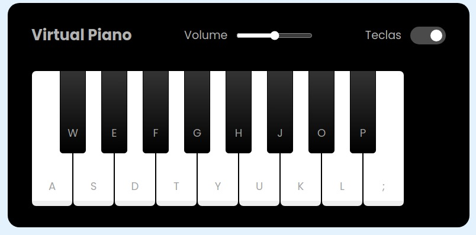

# Javascript Virtual Piano

  

Welcome! In this repository you will find a virtual piano. This project aims to demonstrate several advanced JavaScript game development techniques.

### Technologies Used

- HTML5 and CSS3 for the structure and appearance of the game.
- JavaScript for programming logic and interactivity.

### How to play

1. Clone this repository to your local machine.
2. Open the `index.html` file in your web browser with the help of a local server (e.g. Live server).
3. Hold on Beethoven!!!

### Contribution

Contributions are welcome! If you want to improve this game, add new features, or fix issues, feel free to open a _pull request_.

### Credits

This project was developed as part of an educational project by Digital Innovation One - original repository [here](https://github.com/felipeAguiarCode/js-music-keyboard-virtual) and leave a ⭐️ if you liked the project!
